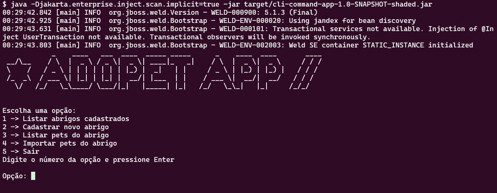

# CLI Command App

Uma aplicação de linha de comando (CLI) desenvolvida em Java que gerencia comandos relacionados a abrigos e pets.

## Funcionalidades

A aplicação permite ao usuário:

1. **Listar abrigos cadastrados**: Exibe uma lista de abrigos armazenados no sistema.
2. **Cadastrar novo abrigo**: Adiciona um novo abrigo ao sistema.
3. **Listar pets do abrigo**: Mostra os pets registrados em um abrigo específico.
4. **Importar pets do abrigo**: Realiza a importação de pets para o abrigo.
5. **Sair**: Encerra o programa.

## Arquitetura

- Utiliza **CDI** (Contexts and Dependency Injection) para gerenciar dependências e executar comandos.
- A classe `CommandRegistry` com escopo `@ApplicationScoped` gerencia o registro e a execução dos comandos.
- Os comandos são identificados por meio da anotação personalizada `@CommandOption`.



## Como executar

Certifique-se de ter o **Java 21** ou superior e o **Maven** instalados.

1. Clone o repositório:
   ```bash
   git clone https://github.com/TiagoBohnenberger/cli-command-app.git
   cd cli-command-app
   
2. Compile o projeto e execute
   ```bash
   mvn package
   java -Djakarta.enterprise.inject.scan.implicit=true -jar target/cli-command-app-1.0-SNAPSHOT-shaded.jar